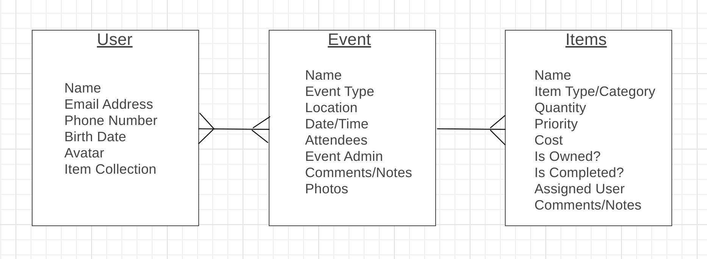

# EventUs: 
## Focus on the party

## Introduction:
### How many times have you gotten to the party and there's no ice?  To the BBQ and there's no charcoal?  How many times have you had to send people away to fetch something that has been forgotten?  Now, there's an app for that! Introducing EventUs!  The perfect online platform that plans every part of your party.

## Entity Relationship Diagram:

## Wireframe of Pages:

## Here is a link to our [pitch deck](https://docs.google.com/presentation/d/1OT_RDEHj0WkTT491Q2uGVndk18ljhklRSpTLNGARV9c/edit?usp=sharing)
## Here is our [Trello Board](https://trello.com/b/7x3lbQZp/unit-3-project-sei)

## LINK TO HEROKU

## Technologies Used:
- Python
- Django
- GitHub
- CSS / HTML
- Spotify API (tbd - stretch)
- SMS Messaging API (tbd)
- 

## Stretch Goals:
- Spotify API
- SMS Messaging 
- Drinking Age Options
- Item Sub-Categories
- Item Purchase Location (API)

